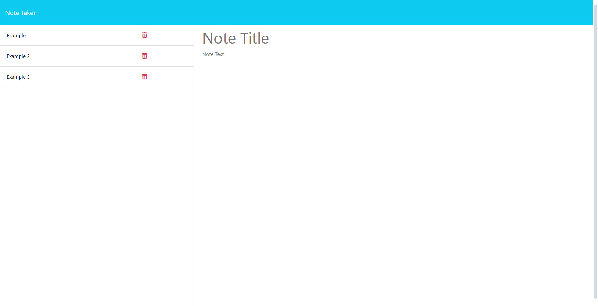

# Note Taker

## The Project

This project was designed for a user to be able to input notes consisting of a title and details. A list item is then automatically generated showing the details of their note. Other features include:

- The ability to delete existing notes.
- A clear button to remove partially or incorrectly entered data.
- Interactive controls in the nav bar depending on the users current action.

## Link & Contents

- [The Deployed Page](https://note-taker-6a7b.onrender.com)
- [Installation](#installation)
- [Usage](#usage)
- [Future Development](#future-development)
- [Credits](#credits)
- [Questions and Feedback](#questions-and-feedback)
- [License](#license)

## Image

## Installation

None necessary, can be accessed via the [browser](https://note-taker-6a7b.onrender.com).

## Usage

Navigate to the note page by selecting 'Get Started'.
Then select 'Note Title' to enter a title followed by 'Note Text' to enter a description.

## Future Development

Future development ideas include:

- Adding optionality to edit existing notes.
- Adding date/ time created.
- Adding differing categories of notes eg. tasks, reminders, important etc.

## Credits

Starter code provided by edX/Monash University.

Project set by edX/Monash University. Made use of the Xpert learning assistant, AskBcs and our instructor with troubleshooting issues.

Render for providing the website hosting.

GitHub for hosting the repository.

## Questions and Feedback

If you find any issues or have contributions or feedback you can do so by opening an [issue](https://github.com/Jiske-N/note-taker/issues) on Github.

## License

None
